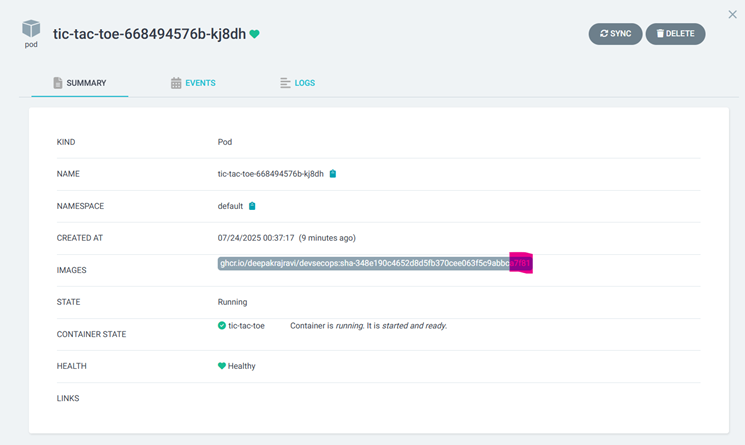

# DevSecOps Demo: Automated CI/CD Pipeline for Secure Kubernetes Deployment

## 🚀 Overview

This project demonstrates a full **DevSecOps pipeline** for a modern TypeScript (React) web application, with security and automation as first-class citizens.

- **CI/CD** with GitHub Actions
- **Containerization** and security scanning
- **Infrastructure as Code** (IaC) and GitOps deployment
- **Automated K8s image updates**
- **Private registry & secret management**

Everything is designed to reflect real-world, production-ready practices—perfect for cloud consulting, SaaS, or public sector environments.

---

## 🛠️ Tech Stack

- **CI/CD:** GitHub Actions
- **Containerization:** Docker, GitHub Container Registry (GHCR)
- **Security:** Trivy (container vulnerability scanning)
- **Kubernetes:** Kind (local), Helm (deployment packaging), ArgoCD (GitOps deployment)
- **IaC:** Terraform (for AWS/EKS, in full stack version)
- **App:** TypeScript, React, Vite, Node.js

---

## 🏗️ Pipeline Architecture

The diagram below illustrates the end-to-end flow of the DevSecOps pipeline—from code commit to secure deployment on Kubernetes using GitHub Actions, Trivy, GHCR, and ArgoCD.


1. **Test & Lint:**  
   Ensures code quality using Vitest and ESLint.
2. **Build:**  
   Compiles the React app for production.
3. **Dockerize:**  
   Builds a Docker image, tags it using the commit SHA (guaranteed lowercase, GH best practice).
4. **Trivy Security Scan:**  
   Blocks pipeline if CRITICAL or HIGH vulnerabilities are found.
5. **Push to GHCR:**  
   Uploads image only if scan passes.
6. **GitOps K8s Deployment:**  
   Automatically updates the Kubernetes deployment YAML with the new image, commits to Git, and triggers ArgoCD for hands-off deployment.

---

## 🔒 Security Highlights

- **Trivy Scanning:** All images are scanned before being pushed/deployed.
- **Image Names:** All lowercase and SHA-tagged (resolves real-world K8s issues).
- **K8s Secrets:** Pulling private images is secured with `docker-registry` secrets.

---

## 📋 Step-by-Step Pipeline

1. **On every push to `main`:**
   - Run unit tests (Vitest)
   - Run static analysis (ESLint)
   - Build production app

2. **Docker & Security:**
   - Build Docker image (`ghcr.io/deepakrajravi/devsecops:sha-<sha>`)
   - Scan with Trivy (fail pipeline if vulnerabilities found)
   - Push image to GHCR

3. **Kubernetes GitOps:**
   - Auto-update `deployment.yaml` to use the new image (guaranteed lowercase)
   - Commit & push YAML (triggers ArgoCD for real deployment)
   - All changes are traceable and auditable in Git

---

## 🚦 Usage

**Clone the repo, then:**

```sh
# Run locally (optional)
npm install
npm run dev

# Build and run Docker locally
docker build -t devsecops-demo:latest .
docker run -p 1010:80 devsecops-demo:latest
```

**K8s Deployment (Kind/Minikube):**
- Install ArgoCD and create required secrets.

---

## 🖼️ Screenshots

### 1. Local Development (NPM)
**Description:** Ran locally: `npm install` and `npm run dev`  


---

### 2. Docker Build and Run
**Description:** Built and ran Docker image locally  


---

### 3. GitHub Actions Pipeline
**Description:** CI/CD: All pipeline stages passed (green) in GitHub Actions  


---

### 4. KIND Cluster Creation
**Description:** Created Kubernetes cluster using KIND (local Kubernetes)  


---

### 5. ArgoCD CRDs and Namespace
**Description:** Created ArgoCD namespace and installed CRDs and ArgoCD itself  


---

### 6. Image Pull Secrets
**Description:** Created Kubernetes imagePullSecrets for private registry access  


---

### 7. Pod Creation and Deployment
**Description:** Successfully created pod with the latest image deployed from `deployment.yaml`  


---

### 8. Service and Pod Deployed
**Description:** Successfully deployed Kubernetes Service and Pod  


---

## 💡 Business Value

- **Security as Code:** Vulnerabilities are blocked before reaching production.
- **Reliability:** Automated, repeatable pipeline ensures deployments are consistent and fast.
- **Traceability:** Every change is logged, auditable, and instantly rollbackable with GitOps.
- **Real-World Ready:** Solves real issues (case-sensitivity, private registry, automated updates) seen in enterprise cloud environments.

---

## 📝 Key Learnings

- End-to-end CI/CD, not just build-and-deploy
- The importance of security scanning (and how to integrate it)
- K8s + GitOps practices for scalable, production-ready delivery
- Debugging real-world DevOps issues (image tags, lowercase, secrets)
- How modern teams deliver secure cloud software at speed

---

## 🙋‍♂️ Author

**Deepakraj Ravi**  
[LinkedIn](https://www.linkedin.com/in/deepakraj-ravi-ba5b1925b/) | [Portfolio](https://deepakraj.dev/resume)
